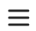

= Get required identifiers from the NetApp Console interface
:hardbreaks:
:nofooter:
:icons: font
:linkattrs:
:imagesdir: ../media/

[.lead]
You can access the NetApp Console web UI to retrieve the identifiers needed for the workflows.

[NOTE]
In addition to the Console web user interface, you can also obtain the ID values through the Cloud Volumes ONTAP REST API. See link:../cm/wf_common_identity_get_supported_srv.html[Get supported services] for more information.

== Get the Console agent identifier

Every Console agent is assigned a unique identifier. You can retrieve system the ID for a Console agent and include it in the `x-agent-id` HTTP request header with each REST API call.

.Before you begin

You must have an account for the Console. You created this account when you first logged in to the Console website and it’s displayed at the top of the Console user interface. See link:https://docs.netapp.com/us-en/console-setup-admin/task-sign-up-saas.html[Sign up or log in to NetApp Console^] for more information.

.Steps

. Navigate to the Console website using a browser:
+
link:https://console.netapp.com/[https://console.netapp.com^]

. Sign in using your account credentials for the Console.

. Select *Administration > Support > Agents*.
+
You can find the console agent system ID at the top of the page.

. You can optionally derive the associated client ID by removing the `clients` suffix. This ID applies when accessing the agent directly in _local mode_ and not through the SaaS interface.
+
*Example*
`uzJbMFKEnuzi2ryLaENbCP52KBTXx0aI`

.After you finish

You can use the agent ID in the `x-agent-id` request header to properly route the request. See the curl examples in the workflows for more information.

== Get the account identifier

Several of the workflows require the account identifier. The following steps show how to obtain the unique identifier for an account.

.About this task

If you maintain multiple accounts, each is assigned a unique identifier.

.Before you begin

You must have an account for the Console. You created this account when you first logged in to the Console website and it's displayed at the top of the Console user interface. link:https://docs.netapp.com/us-en/console-setup-admin/task-sign-up-saas.html[Sign up or log in to NetApp Console^].

.Steps

. Navigate to the Console website using a browser:
+
link:https://console.netapp.com/[https://console.netapp.com^]

. Sign in using your account credentials for the Console.

. Select the   icon at the top left of the page.

. Select *Administration* and then select *Identity and access*.
+
Your account ID is shown at the top of the *Organization* page.
